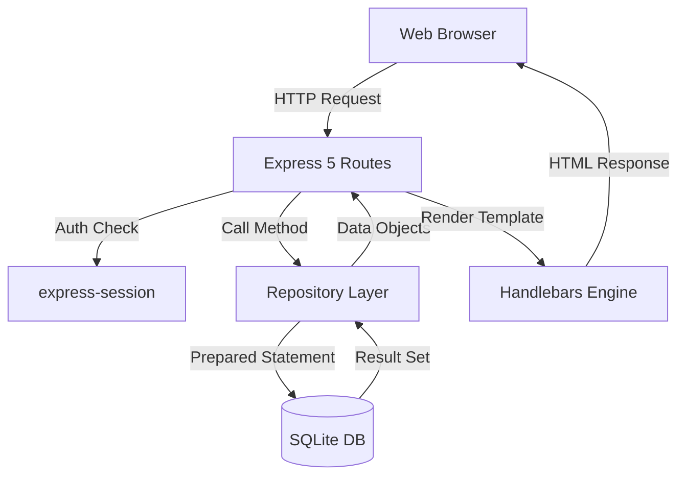

# Technical Report: Library Management System

## 1. Application Architecture
The application follows a **Layered Architecture** pattern, specifically employing the **Repository Pattern** to decouple business logic from data access.

### Component Overview
- **Presentation Layer (View)**: Server-side rendered HTML using `express-handlebars`.
- **Controller Layer (Routes)**: Express 5 routes that handle HTTP requests, validate session state, and coordinate between repositories.
- **Data Access Layer (Repositories)**: Dedicated repository classes (e.g., `bookRepo`, `userRepo`) that encapsulate all raw SQL queries using `better-sqlite3`.
- **Persistence Layer**: A lightweight SQLite database ensuring portability and zero-configuration.

### Architecture Diagram

---

## 2. Design Choices

### Raw SQL vs. ORM
A strict decision was made to avoid ORMs (Object-Relational Mappers). 
- **Reasoning**: Compliance with technical specifications and a desire for maximum performance and transparency.
- **Implementation**: Every query is written in raw SQL using `db.prepare()` to prevent SQL injection.

### Repository Pattern
Instead of placing SQL queries directly inside route handlers, all database logic is isolated in repositories.
- **Reasoning**: This ensures that if the database schema changes, only the repository needs modification, not the routing logic. It also makes the code more testable and organized.

### Soft Deletion
The system implements a `is_active` flag for books and authors.
- **Reasoning**: Hard-deleting a book that has historical loan records would cause referential integrity issues (orphaned records). Soft deletion preserves the audit trail while hiding the item from the current catalog.

### State Management
`express-session` is used for authentication and authorization.
- **Reasoning**: Since the application is a server-side rendered (SSR) monolith, session-based auth is more idiomatic and simpler to implement than JWTs, providing secure state tracking across requests.

---

## 3. Considered Trade-offs

### Development Speed vs. Maintainability
- **Trade-off**: Using the Repository pattern and modular routing increased the initial setup time compared to a "fat-controller" approach.
- **Decision**: Prioritized maintainability. As the project grows, adding new features (like advanced search or fine-grained permissions) is significantly easier with this structure.

### SQLite vs. Client-Server DB (PostgreSQL/MySQL)
- **Trade-off**: SQLite lacks some advanced concurrent write capabilities and user management features found in PostgreSQL.
- **Decision**: Prioritized ease of deployment and zero-dependency installation. For the expected load of a library management system, SQLite's performance is more than sufficient.

### Server-Side Rendering (SSR) vs. SPA (React/Vue)
- **Trade-off**: SSR (Handlebars) offers less interactivity and requires full page reloads for most actions compared to a Single Page Application.
- **Decision**: Prioritized simplicity and compliance. SSR reduces the complexity of the tech stack (no need for a separate API layer and frontend build pipeline) while providing faster initial page loads.
